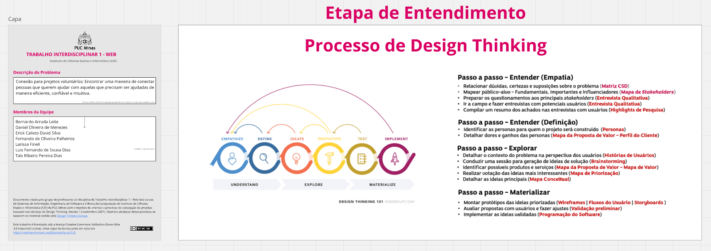
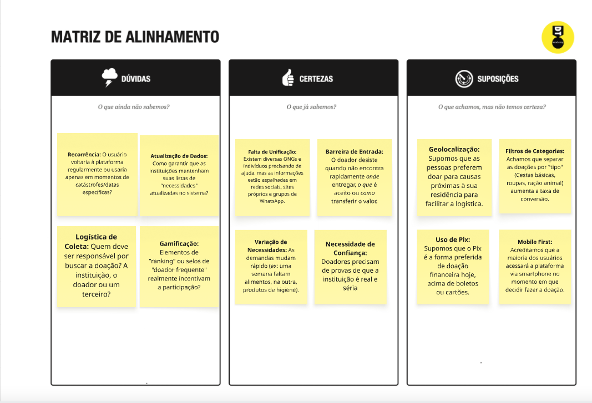
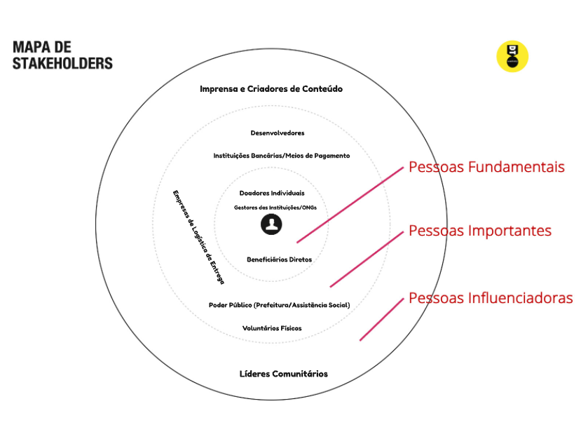
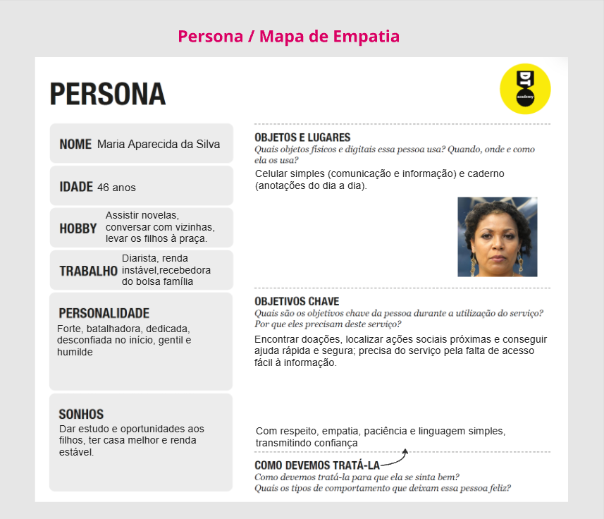
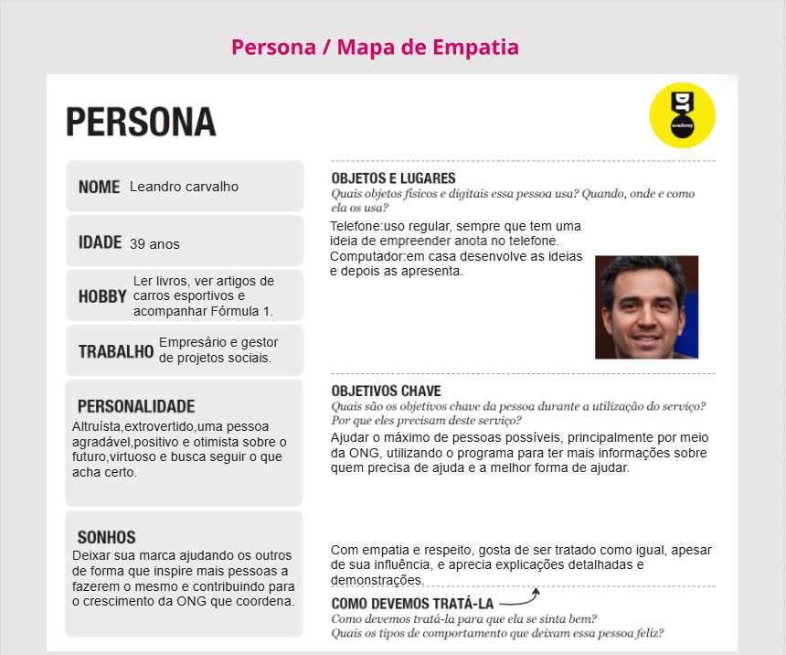
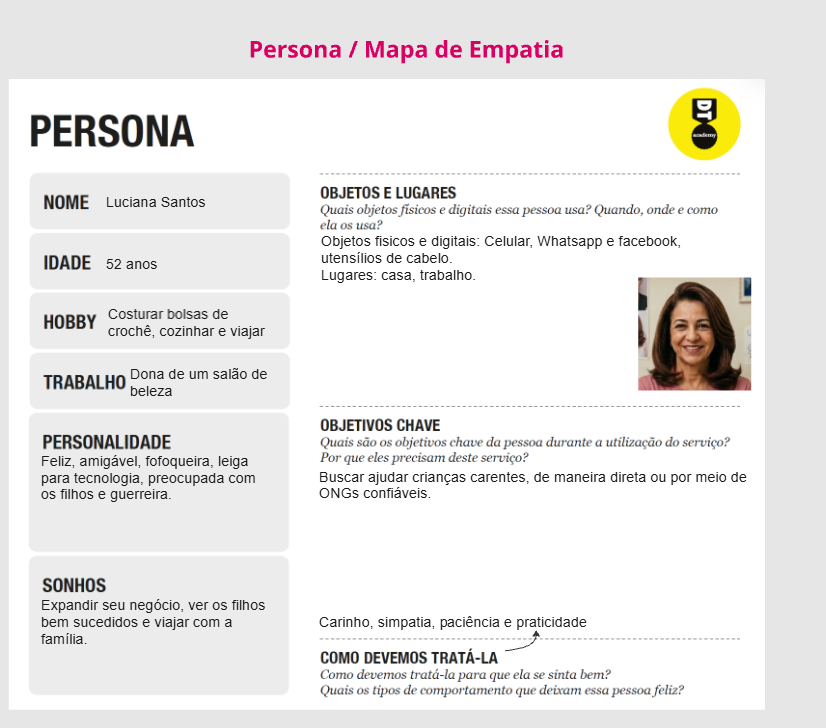
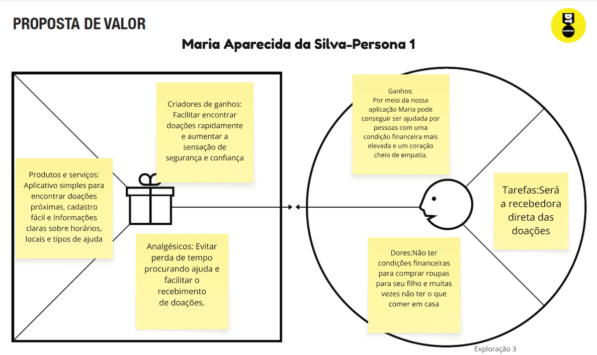
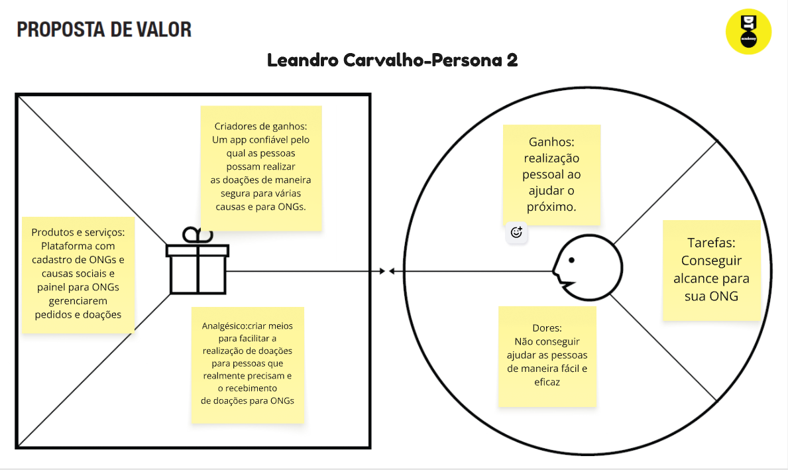
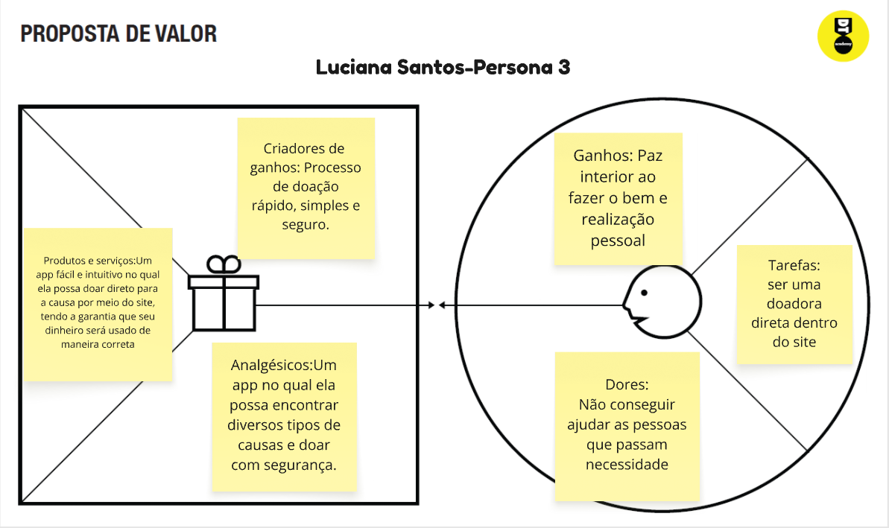
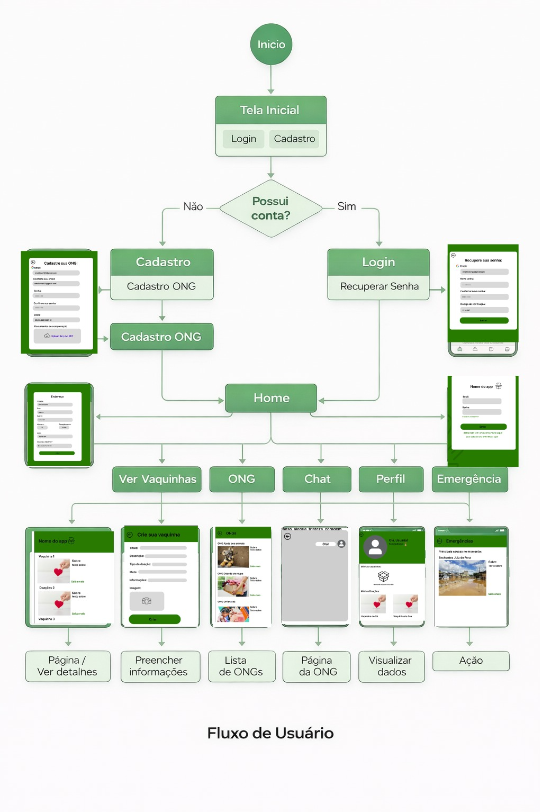

# Introdução

Informações básicas do projeto.

* **Projeto:** ConectaPlus
* **Repositório GitHub:** https://github.com/ICEI-PUC-Minas-PMGES-TI/pmg-es-2026-1-ti1-0427200-devconnect-2.git
* **Membros da equipe:**

* Luís Fernando de Sousa Dias
* Bernardo Arruda Leite
* Daniel Oliveira de Menezes 
* Erick Calixto David Silva
* Larissa Fineli
* Fernando de Oliveira Palheiros
* Tais Ribeiro Pereira Dias

A documentação do projeto é estruturada da seguinte forma:

1. Introdução
2. Contexto
3. Product Discovery
4. Product Design
5. Metodologia
6. Solução
7. Referências Bibliográficas



# Contexto


## Problema
A realização de doações ainda apresenta dificuldades, principalmente quando se trata de doar diretamente para pessoas, organizações não governamentais (ONGs) ou campanhas solidárias, como vaquinhas. Muitas vezes, os doadores enfrentam insegurança quanto à confiabilidade dessas ações, além da falta de praticidade no processo.
Esse cenário gera barreiras que dificultam a conexão entre quem deseja ajudar e quem realmente precisa de apoio, tornando o processo menos eficiente e acessível.

## Objetivos
O objetivo geral deste trabalho é desenvolver uma aplicação que facilite o processo de doações e aumente a confiabilidade entre doadores e beneficiários. Dessa forma, doações como arrecadação de roupas, alimentos, contribuições financeiras (vaquinhas) e apoio a ONGs de diversos segmentos serão realizadas de maneira mais simples, segura e eficiente, ampliando o alcance da ajuda a pessoas em situação de vulnerabilidade.
Como objetivos específicos, destacam-se:
-Desenvolver um sistema que conecte doadores a instituições e pessoas que necessitam de ajuda, de forma organizada e acessível;
-Implementar mecanismos que garantam a transparência e a confiabilidade das doações realizadas na plataforma;
-Facilitar o acompanhamento das doações, permitindo que os usuários visualizem o impacto de suas contribuições. 


## Justificativa
A realização de doações tem apresentado um declínio ao longo do tempo. De acordo com informações do site nossacausa.com, embora a solidariedade aumente em períodos de crise, a prática de doações contínuas ainda representa um desafio significativo. Entre os indivíduos que não realizam doações, destacam-se como principais barreiras a falta de recursos financeiros e, principalmente, a desconfiança em relação à forma como o dinheiro é utilizado pelas organizações.

Esse cenário impacta diretamente pessoas em situação de vulnerabilidade e instituições (ONGs) que dependem dessas contribuições para manter suas atividades. A ausência de transparência e de mecanismos confiáveis reduz o engajamento dos doadores, agravando ainda mais o problema.

Diante disso, o desenvolvimento de uma aplicação digital se justifica como uma alternativa para minimizar essas barreiras. A proposta busca aumentar a confiabilidade, a transparência e a praticidade no processo de doação, facilitando a conexão entre doadores e instituições. Assim, a aplicação pretende contribuir para o aumento do volume de doações e para a melhoria do apoio a pessoas que necessitam de assistência.

## Público-Alvo
Mercado: A solução proposta está inserida no mercado de tecnologia voltada ao impacto social, mais especificamente no segmento de plataformas digitais de doações. Esse mercado busca conectar pessoas dispostas a ajudar com indivíduos ou instituições que necessitam de apoio, utilizando a tecnologia para tornar o processo mais acessível, seguro e transparente.

Público-Alvo: O público-alvo da aplicação é composto por pessoas e organizações que se identificam com causas sociais e desejam participar de ações solidárias. O sistema é voltado principalmente para indivíduos que querem doar de forma prática e confiável, além de instituições que necessitam de meios eficientes para arrecadar recursos.
Exemplo: pessoas que desejam contribuir com dinheiro, roupas ou alimentos, e ONGs que promovem campanhas sociais.

Perfis de Usuários:
Doadores: são pessoas com conhecimento básico a intermediário em tecnologia, acostumadas ao uso de smartphones e aplicativos. Buscam praticidade, segurança e transparência ao realizar doações, principalmente financeiras, além de desejarem acompanhar o destino de suas contribuições.
Exemplo: um usuário que realiza doações online para campanhas ou vaquinhas solidárias.

ONGs e Instituições: Apresentam níveis variados de conhecimento tecnológico, desde equipes estruturadas até organizações com pouca experiência digital. Utilizam a plataforma para cadastrar campanhas, gerenciar doações e prestar contas aos doadores, necessitando de um sistema simples e acessível.
Exemplo: uma ONG que organiza arrecadação de alimentos ou roupas para comunidades carentes.

Beneficiários: São pessoas em situação de vulnerabilidade que recebem as doações. Em geral, possuem acesso limitado à tecnologia e dependem das instituições para intermediar o recebimento dos recursos, embora alguns possam utilizar diretamente a plataforma.
Exemplo: famílias de baixa renda que recebem cestas básicas ou apoio financeiro por meio de campanhas.

## Etapa de Entendimento
A prática de doações no Brasil apresenta um cenário relevante, porém desafiador. Segundo a CNN Brasil (2022), cerca de 84% dos brasileiros já realizaram algum tipo de doação, evidenciando o potencial solidário da população.

Apesar disso, a continuidade dessas doações é limitada. De acordo com a Nossa Causa (2024), a falta de confiança nas instituições é uma das principais barreiras, levando muitos doadores a se tornarem mais cautelosos. Além disso, as doações tendem a ser irregulares, já que muitos usuários buscam informações antes de contribuir.

Paralelamente, uma parcela significativa da população vive em situação de vulnerabilidade e depende dessas doações para suprir necessidades básicas. Nesse contexto, torna-se necessária a criação de soluções tecnológicas que aumentem a transparência e facilitem a conexão entre doadores, instituições e beneficiários.


# Product Discovery

## Etapa de Entendimento





## Pesquisa de entendimento
Pesquisas mostram que as doações no Brasil vêm crescendo e atingem valores altos, mas não acontecem de forma constante ao longo do tempo. Segundo dados da plataforma Nossa Causa, grande parte das contribuições ocorre em momentos de crise, como desastres naturais ou emergências, quando há maior mobilização da sociedade. No entanto, fora desses períodos, o volume de doações tende a diminuir, o que dificulta a continuidade de projetos sociais.
Além disso, o comportamento do doador brasileiro mudou: as pessoas estão mais criteriosas e informadas, buscando entender melhor para onde o dinheiro será destinado antes de contribuir. Apesar disso, a falta de confiança ainda é uma das principais barreiras. Apenas uma pequena parcela da população acredita plenamente nas ONGs, e muitos deixam de doar após notícias negativas ou suspeitas de má gestão.
Outro desafio importante está na própria estrutura das organizações. Muitas ONGs operam com poucos recursos e dependem diretamente de doações, o que dificulta a manutenção de projetos a longo prazo. Ao mesmo tempo, a demanda por ajuda só cresce, impulsionada por problemas sociais como pobreza, fome e desigualdade, que atingem milhões de brasileiros
Diante desse cenário, as pessoas mais impactadas são aquelas em situação de vulnerabilidade, que dependem dessas iniciativas para acesso a alimentos, abrigo, educação e apoio básico. Quando as doações não são constantes ou diminuem, esses grupos acabam sendo diretamente prejudicados.


## Etapa de Definição

### Personas









# Product Design


## Histórias de Usuários

1-Como doador, preciso encontrar projetos sociais próximos, para ajudar as pessoas da minha região.

2-Como vítima de uma enchente, preciso de um meio seguro para realizar uma vaquinha, para conseguir reconstruir minha casa.

3-Como ONG, preciso de um local para divulgar e ampliar o alcance das minhas ações, para conseguir arrecadar dinheiro e ajudar pessoas.

4-Como pessoa necessitada, preciso de um aplicativo acessível e intuitivo, para encontrar pontos de doação e pessoas que possam me ajudar.

5-Como doador, preciso ver avaliações das ONGs, para garantir que minha doação será bem utilizada.

6-Como ONG, preciso de uma maneira de encontrar mais pessoas necessitadas, para poder ajudá-las da melhor forma possível, seja com alimentos, roupas ou outros recursos.

7-Como doador, preciso escolher o tipo de doação (dinheiro, alimento, roupa), para ajudar da forma que eu puder.

8-Como pessoa necessitada, preciso de uma forma de pedir doações de material escolar, para que meu filho tenha os materiais necessários para ir à escola.

9-Como vítima de um acidente, preciso realizar uma vaquinha de forma rápida e segura, para pagar uma cirurgia.


## Proposta de Valor








## Requisitos

As tabelas que se seguem apresentam os requisitos funcionais e não funcionais que detalham o escopo do projeto.

### Requisitos Funcionais

| ID     | Descrição do Requisito                                   | Prioridade |
| ------ | ---------------------------------------------------------- | ---------- |
| RF-001 | Permitir que o usuário cadastre tarefas ⚠️ EXEMPLO ⚠️ | ALTA       |
| RF-002 | Emitir um relatório de tarefas no mês ⚠️ EXEMPLO ⚠️ | MÉDIA     |

### Requisitos não Funcionais

| ID      | Descrição do Requisito                                                              | Prioridade |
| ------- | ------------------------------------------------------------------------------------- | ---------- |
| RNF-001 | O sistema deve ser responsivo para rodar em um dispositivos móvel ⚠️ EXEMPLO ⚠️ | MÉDIA     |
| RNF-002 | Deve processar requisições do usuário em no máximo 3s ⚠️ EXEMPLO ⚠️          | BAIXA      |

> ⚠️ **APAGUE ESSA PARTE ANTES DE ENTREGAR SEU TRABALHO**
>
> Os requisitos de um projeto são classificados em dois grupos:
>
> - [Requisitos Funcionais (RF)](https://pt.wikipedia.org/wiki/Requisito_funcional):
>   correspondem a uma funcionalidade que deve estar presente na plataforma (ex: cadastro de usuário).
> - [Requisitos Não Funcionais (RNF)](https://pt.wikipedia.org/wiki/Requisito_n%C3%A3o_funcional):
>   correspondem a uma característica técnica, seja de usabilidade, desempenho, confiabilidade, segurança ou outro (ex: suporte a dispositivos iOS e Android).
>
> Lembre-se que cada requisito deve corresponder à uma e somente uma característica alvo da sua solução. Além disso, certifique-se de que todos os aspectos capturados nas Histórias de Usuário foram cobertos.
>
> **Orientações**:
>
> - [O que são Requisitos Funcionais e Requisitos Não Funcionais?](https://codificar.com.br/requisitos-funcionais-nao-funcionais/)
> - [O que são requisitos funcionais e requisitos não funcionais?](https://analisederequisitos.com.br/requisitos-funcionais-e-requisitos-nao-funcionais-o-que-sao/)

## Projeto de Interface


### Wireframes


Link wireframe feito no figma:https://www.figma.com/design/o51VD9pVx5BRzSMtVlPGFM/Sem-t%C3%ADtulo--c%C3%B3pia-?node-id=0-1&t=DsZM3jxwi1H6cR55-1


### User Flow





### Protótipo Interativo


 [Protótipo Interativo (Figma)](https://www.figma.com/proto/6Sr3SsCDFay15DySpWLEMa/Sem-t%C3%ADtulo?node-id=1-1934&p=f&t=GY7HPRstz0mHn3M0-1&scaling=min-zoom&content-scaling=fixed&page-id=0%3A1&starting-point-node-id=1%3A1934) 


# Metodologia


## Ferramentas
Linguagens:HTML,CSS e JavaScript  

Editor de código: Visual Studio Code.

Comunicação: WhatsApp.

Versionamento e repositório: GitHub, utilizado para controle de versões e armazenamento do projeto.

Processo de Design Thinking: Miro.

Wireframes e protótipos: Figma.


## Gerenciamento do Projeto

Divisão de papéis:
 Luís Fernando de Sousa Dias:Criação do protótipo interativo e documentação
 Bernardo Arruda Leite:Criação de wireframes
 Daniel Oliveira de Menezes :Criação de slides para apresentação
 Erick Calixto David Silva:Criação de wireframes
 Larissa Fineli:Criação do fluxograma
 Fernando de Oliveira Palheiros:Criação do fluxograma
 Tais Ribeiro Pereira Dias:Criação de slides para apresentação

Backlog: Codificação do projeto
A Fazer:
Em Andamento:Divisão do papéis na apresentação
Concluído: Matriz CSD, Mapa de Stakeholders, Personas, Proposta de Valor, Wireframe, Fluxo de Telas, Documentação.

## Referências Bibliográficas
Nossa Causa
IDIS
GIFE
CNN Brasil
Belém.com.br
HAJA ONG
G1


# Solução Implementada

Esta seção apresenta todos os detalhes da solução criada no projeto.

## Vídeo do Projeto

O vídeo a seguir traz uma apresentação do problema que a equipe está tratando e a proposta de solução. ⚠️ EXEMPLO ⚠️

[](https://youtu.be/flZp64N3UW8)

## Funcionalidades

Esta seção apresenta as funcionalidades da solução.Info

##### Funcionalidade 1 - Cadastro de Contatos ⚠️ EXEMPLO ⚠️

Permite a inclusão, leitura, alteração e exclusão de contatos para o sistema

* **Estrutura de dados:** [Contatos](#ti_ed_contatos)
* **Instruções de acesso:**
  * Abra o site e efetue o login
  * Acesse o menu principal e escolha a opção Cadastros
  * Em seguida, escolha a opção Contatos
* **Tela da funcionalidade**:


> ⚠️ **APAGUE ESSA PARTE ANTES DE ENTREGAR SEU TRABALHO**
>
> Apresente cada uma das funcionalidades que a aplicação fornece tanto para os usuários quanto aos administradores da solução.
>
> Inclua, para cada funcionalidade, itens como: (1) titulos e descrição da funcionalidade; (2) Estrutura de dados associada; (3) o detalhe sobre as instruções de acesso e uso.

## Estruturas de Dados

Descrição das estruturas de dados utilizadas na solução com exemplos no formato JSON.Info

##### Estrutura de Dados - Contatos   ⚠️ EXEMPLO ⚠️

Contatos da aplicação

```json
  {
    "id": 1,
    "nome": "Leanne Graham",
    "cidade": "Belo Horizonte",
    "categoria": "amigos",
    "email": "Sincere@april.biz",
    "telefone": "1-770-736-8031",
    "website": "hildegard.org"
  }
  
```

##### Estrutura de Dados - Usuários  ⚠️ EXEMPLO ⚠️

Registro dos usuários do sistema utilizados para login e para o perfil do sistema

```json
  {
    id: "eed55b91-45be-4f2c-81bc-7686135503f9",
    email: "admin@abc.com",
    id: "eed55b91-45be-4f2c-81bc-7686135503f9",
    login: "admin",
    nome: "Administrador do Sistema",
    senha: "123"
  }
```

> ⚠️ **APAGUE ESSA PARTE ANTES DE ENTREGAR SEU TRABALHO**
>
> Apresente as estruturas de dados utilizadas na solução tanto para dados utilizados na essência da aplicação quanto outras estruturas que foram criadas para algum tipo de configuração
>
> Nomeie a estrutura, coloque uma descrição sucinta e apresente um exemplo em formato JSON.
>
> **Orientações:**
>
> * [JSON Introduction](https://www.w3schools.com/js/js_json_intro.asp)
> * [Trabalhando com JSON - Aprendendo desenvolvimento web | MDN](https://developer.mozilla.org/pt-BR/docs/Learn/JavaScript/Objects/JSON)

## Módulos e APIs

Esta seção apresenta os módulos e APIs utilizados na solução

**Images**:

* Unsplash - [https://unsplash.com/](https://unsplash.com/) ⚠️ EXEMPLO ⚠️

**Fonts:**

* Icons Font Face - [https://fontawesome.com/](https://fontawesome.com/) ⚠️ EXEMPLO ⚠️

**Scripts:**

* jQuery - [http://www.jquery.com/](http://www.jquery.com/) ⚠️ EXEMPLO ⚠️
* Bootstrap 4 - [http://getbootstrap.com/](http://getbootstrap.com/) ⚠️ EXEMPLO ⚠️

> ⚠️ **APAGUE ESSA PARTE ANTES DE ENTREGAR SEU TRABALHO**
>
> Apresente os módulos e APIs utilizados no desenvolvimento da solução. Inclua itens como: (1) Frameworks, bibliotecas, módulos, etc. utilizados no desenvolvimento da solução; (2) APIs utilizadas para acesso a dados, serviços, etc.

# Referências

As referências utilizadas no trabalho foram:

* SOBRENOME, Nome do autor. Título da obra. 8. ed. Cidade: Editora, 2000. 287 p ⚠️ EXEMPLO ⚠️

> ⚠️ **APAGUE ESSA PARTE ANTES DE ENTREGAR SEU TRABALHO**
>
> Inclua todas as referências (livros, artigos, sites, etc) utilizados no desenvolvimento do trabalho.
>
> **Orientações**:
>
> - [Formato ABNT](https://www.normastecnicas.com/abnt/trabalhos-academicos/referencias/)
> - [Referências Bibliográficas da ABNT](https://comunidade.rockcontent.com/referencia-bibliografica-abnt/)
